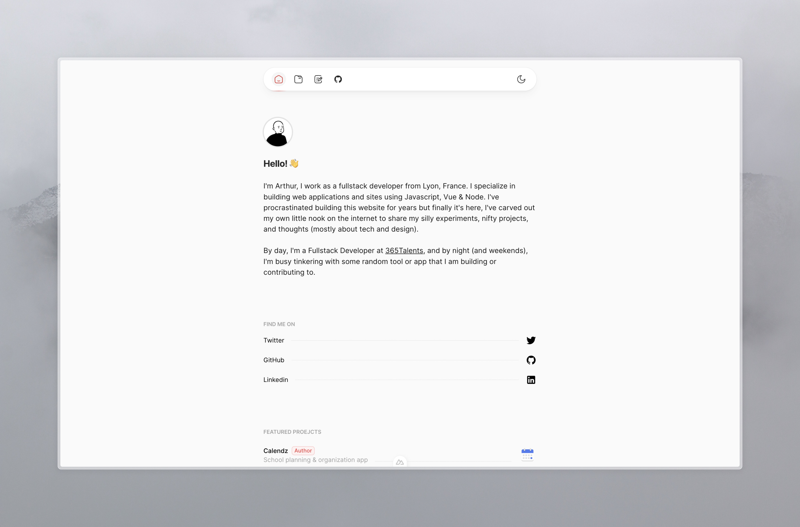

# arthurdufour.dev

This is my personal portfolio website, made with Nuxt (using their [Portfolio](https://github.com/nuxt-ui-templates/portfolio) template)!

## Tech Stack

1. Vue
2. Tailwind CSS
3. Nuxt JS
4. Nuxt Content Module

## Todo

1. Create a "uses" page (list of applications / hardware I use and enjoy)
