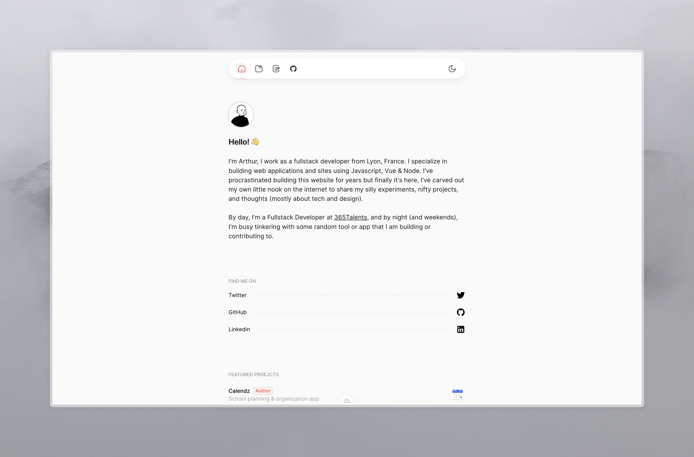

# arthurdufour.dev

This is my personal portfolio website, made with Nuxt (using [Zooper](https://zooper.pages.dev) template)!

## Tech Stack

1. Vue
2. Tailwind CSS
3. Nuxt JS
4. Nuxt Content Module
5. Shiki JS ES

## Todo

1. Integrate Plausible for privacy-friendly analytics
2. Create a "uses" page (list of applications / hardware I use and enjoy)
